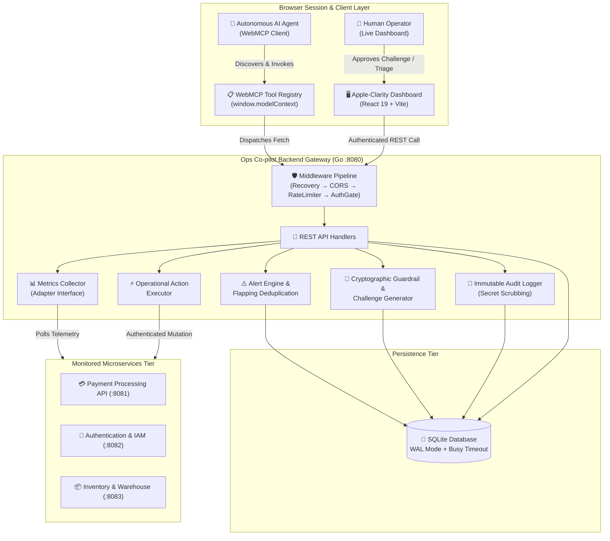
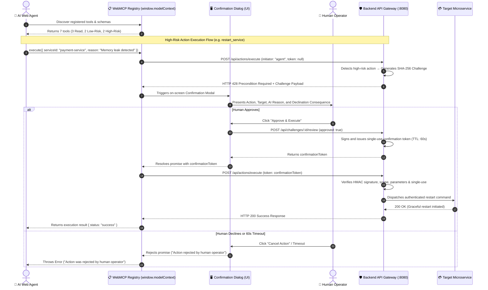
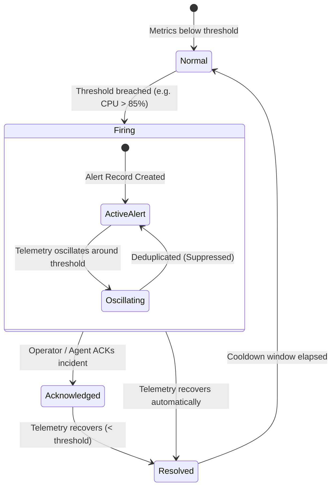
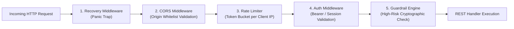
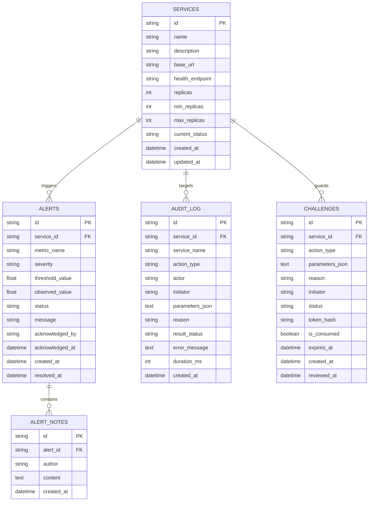

# Ops Co-pilot: System Architecture & Technical Specifications

> **Ops Co-pilot** is an AI-friendly observability, incident triage, and human-guarded operational execution platform designed for autonomous web agents operating through standardized browser-level **WebMCP (Web Model Context Protocol)** interfaces.

---

## 1. High-Level Architectural Topology

The system is architected into three distinct execution tiers:
1. **The Client & Agent Execution Layer:** A React 19 + TypeScript SPA exposing registered WebMCP tools onto `window.modelContext` and providing an Apple-clarity operational dashboard.
2. **The Backend Core & Guardrail Gateway:** A high-performance Go REST API backed by an embedded SQLite database (WAL mode), managing state machines, rate limits, alerts, and cryptographic execution challenges.
3. **The Monitored Infrastructure Tier:** Distributed microservices exposing live Prometheus-compatible `/metrics`, `/health`, and authenticated `/control/*` endpoints.



---

## 2. WebMCP Protocol & Discovery Pipeline

Ops Co-pilot implements the **Web Model Context Protocol (WebMCP)** draft standard. Instead of relying on fragile DOM scraping or synthetic clicks, AI web agents discover capabilities directly through JavaScript bindings.

### Tool Discovery Flow
1. Upon SPA initialization, `registerWebMCPTools()` instantiates 7 operational tools and binds them to `window.modelContext.tools` and `document.modelContext`.
2. When an autonomous agent navigates to the dashboard, it queries `window.modelContext` to discover available functions, input schemas, and required parameters.
3. When the agent invokes a tool:
   - **Read-only / Low-risk tools** execute immediately via the backend API.
   - **High-risk tools** trigger an asynchronous promise that pauses agent execution and surfaces an on-screen **Human Confirmation Dialog**.



---

## 3. Structural Safety Tiers & Cryptographic Guardrails

Every operation in Ops Co-pilot is classified into one of three strict safety tiers:

| Safety Tier | Actions Included | Execution Mode | Security Verification |
|---|---|---|---|
| **Tier 1: Read-Only** | `get_service_health`, `list_active_alerts`, `get_audit_log` | Immediate | Bearer Auth Gate |
| **Tier 2: Low-Risk Write** | `acknowledge_alert`, `add_incident_note` | Immediate | Bearer Auth Gate + Input Sanitization |
| **Tier 3: High-Risk Mutative** | `restart_service`, `scale_service` | **Halted for Human Review** | Single-Use SHA-256 HMAC Token + 60s TTL |

### Cryptographic Token Formulation
When a human operator approves an action, the backend constructs a cryptographically bound confirmation token:

$$\text{Signature} = \text{HMAC-SHA256}(\text{Secret}, \text{ChallengeID} \parallel \text{ServiceID} \parallel \text{ActionType} \parallel \text{ParamsHash} \parallel \text{ExpiresAt})$$

```
Token Format: <ChallengeID>.<ExpiresAtTimestamp>.<HMAC-Hex-Signature>
```

### Tampering Prevention Properties:
1. **Single-Use Consumption:** When verified, the token is instantly marked as `consumed` in a database transaction (`UPDATE challenges SET is_consumed = 1 WHERE ...`). Replaying the same token returns `HTTP 409 Conflict`.
2. **Time-To-Live (TTL):** Tokens expire after 60 seconds. Late requests return `HTTP 410 Gone`.
3. **Parameter Binding:** If an attacker or agent modifies the replica count or target service after approval, the HMAC signature verification fails immediately (`HTTP 403 Forbidden`).

---

## 4. Alert Engine & Flapping Deduplication

To prevent alert fatigue and notification storms caused by noisy telemetry oscillations, Ops Co-pilot implements an **active state-machine deduplication engine**.



### Deduplication Rules:
- **Active Alert Suppression:** If an alert is already `firing` for a specific service and metric, subsequent breaches are deduplicated and appended as telemetry samples rather than creating duplicate notifications.
- **Flapping Protection:** Rapid transitions between healthy and unhealthy states within a 30-second window update the existing alert rather than generating rapid-fire alert noise.

---

## 5. Security Architecture & Defense-in-Depth

The backend enforces a strict multi-layer security perimeter on every incoming HTTP request:



1. **Recovery Middleware:** Catches unhandled panics, logs stack traces securely, and returns structured `500 Internal Server Error` without crashing the daemon.
2. **CORS Origin Whitelist:** Validates the `Origin` header against configured production and local domains (`cfg.AllowedOrigins`). Unauthorized preflights receive `403 Forbidden`.
3. **IP-Normalized Token Bucket Rate Limiter:** Strips ephemeral client ports via `net.SplitHostPort` and enforces a 20 req/s rate with a burst capacity of 40 tokens. Excess calls receive `HTTP 429 Too Many Requests`.
4. **API Key / Bearer Authentication Gate:** Validates requests against `OPS_COPILOT_AUTH_SECRET` (exempting only `/api/health`). Unauthorized calls receive `HTTP 401 Unauthorized`.
5. **Secret Scrubbing in Audit Trail:** Sensitive fields (tokens, passwords, API keys, headers) are automatically masked with `[REDACTED_SECRET]` before persistence in the immutable audit ledger.

---

## 6. Persistence & Database Schema

The database uses **SQLite with Write-Ahead Logging (WAL)** mode for concurrent read/write scalability without table-level blocking.



---

## 7. Technology Stack Summary

| Layer | Technologies Used | Key Rationale |
|---|---|---|
| **Frontend SPA** | React 19, TypeScript, Vite, TailwindCSS, Lucide Icons | Sub-second load times, declarative UI, zero-runtime overhead |
| **Agent Interface** | WebMCP (`window.modelContext` / `document.modelContext`) | Standardized AI discovery without DOM scraping |
| **Backend Core** | Go 1.22 (`net/http`, standard library HTTP router) | Zero third-party framework bloat, fast startup, concurrent safety |
| **Persistence** | SQLite 3 (WAL mode, `modernc.org/sqlite` pure Go driver) | Zero external database dependencies, CGO-free, fast embedded execution |
| **Monitored Services** | Go Microservices (Payment, Auth, Inventory on 8081–8083) | Real-world multi-service telemetry and chaos simulation |
