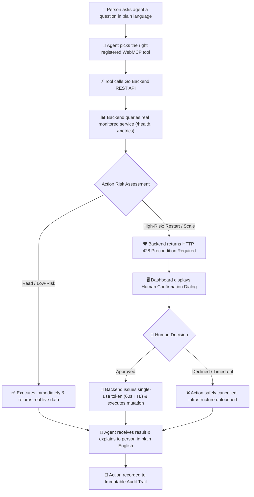

# Ops Co-pilot

[](https://github.com/kuldeep-poonia/ops-copilot/actions)
[](LICENSE)
[](https://go.dev)
[](https://react.dev)
[](https://github.com/kuldeep-poonia/ops-copilot#webmcp-tools)

> An AI-friendly observability and incident remediation dashboard that allows autonomous web agents to inspect infrastructure telemetry and execute operational actions with cryptographic human-in-the-loop guardrails.

Ops Co-pilot doesn't add its own AI — it gives any AI agent already in your browser a safe, structured way to check on and operate your real infrastructure, with a human always in control of anything risky.

---

## What Problem Does It Solve?

When AI agents are given operational control over infrastructure, traditional dashboards either lock them out completely or give them unrestricted write access that risks catastrophic production outages. 

**Ops Co-pilot bridges this gap** by exposing standardized, in-browser WebMCP tools with structural safety tiering:
1. **Read-Only & Low-Risk Tools:** Agents can freely inspect telemetry, list firing alerts, acknowledge incidents, and post diagnostic notes.
2. **High-Risk Guardrails:** Disruptive actions (restarting services, scaling replicas) are intercepted by the backend. The action is paused until an on-screen human operator reviews the technical rationale and approves a single-use, SHA-256 bound cryptographic confirmation token with a 60-second TTL.

---

## How It Works

Here is how a real end-to-end interaction works when someone operates their infrastructure with an AI agent in the browser:

1. **The dashboard registers its tools.** When someone opens the Ops Co-pilot dashboard in an agent-capable browser (ChatGPT's in-app browser, or Chrome with the WebMCP flag enabled), the page registers its WebMCP tools via `document.modelContext.registerTool(...)`. From this point, any AI agent operating in that browser session can see exactly what actions are available — not by reading the page visually, but by reading this structured tool list.

2. **The person asks the agent something in plain language.** For example: *"Is everything okay with my service?"* or *"Restart the payment service, it's throwing errors."*

3. **The agent picks the right tool and calls it.** Based on each tool's `name` and `description`, the agent decides which one fits the request — e.g. `get_service_health` for a status question — and calls it with the required parameters. This reasoning is done entirely by the agent's own model; Ops Co-pilot does not do any of the natural-language understanding itself.

4. **The tool call reaches the real backend.** The tool's `execute` function calls the Go backend's REST API, which in turn queries the real monitored service (its actual `/health` and `/metrics` endpoints) for genuinely current data — never simulated or cached-as-if-live data.

5. **Read and low-risk actions execute immediately and return real results**, which the agent then explains to the person in natural language.

6. **High-risk actions (restart, scale) never execute on the first call.** The backend responds with `428 Precondition Required` and a description of the proposed action. The dashboard shows an on-screen confirmation dialog to the person — not the agent — describing exactly what is about to happen and why. Only if a person explicitly approves does the backend issue a single-use, time-limited confirmation token and actually execute the action.

7. **Every action, agent-initiated or human-initiated, is written to an audit log** visible on the dashboard, so there's always a clear record of who did what.

### Interaction Flow



---

## Live Deployments & Demo

- **Live Web Dashboard (Vercel):** [https://ops-copilot-two.vercel.app](https://ops-copilot-two.vercel.app)
- **Production API Backend (Render):** [https://ops-copilot-nspl.onrender.com](https://ops-copilot-nspl.onrender.com)
- **Monitored Real Microservice:** [https://social-mcp.duckdns.org](https://social-mcp.duckdns.org)
- **Product Demo Video (1080p MP4):** [assets/ops-copilot-demo-video.mp4](assets/ops-copilot-demo-video.mp4)
- **Local Dev Server:** [http://localhost:5173](http://localhost:5173)

---

## 🚀 Quick Start & User Guide

Users and developers can interact with Ops Co-pilot using either the **In-App WebMCP Console**, the **Native Browser WebMCP API**, or by **Registering Custom Microservices**:

### Option 1: In-App WebMCP Console (Zero Setup ⭐)
1. Open the live dashboard: [**https://ops-copilot-two.vercel.app**](https://ops-copilot-two.vercel.app)
2. Click the **"WebMCP Agent Console"** tab.
3. Select **`get_service_health`** and click **"Invoke WebMCP Tool"** $\rightarrow$ Instant live telemetry JSON is returned.
4. Select **`restart_service`**, enter a reason (*"Testing WebMCP guardrail"*), and click **"Invoke WebMCP Tool"**.
5. 👉 **The Guardrail in Action:** The backend responds with `HTTP 428 Precondition Required`, popping up the **Human Confirmation Dialog Modal** on your screen. Click **"Approve & Execute"** to authorize the action.
6. Switch to the **"Audit Log"** tab to see the permanent, cryptographic audit record of the execution.

### Option 2: Native Chrome WebMCP Testing API (`chrome://flags`)
1. Enable WebMCP in Google Chrome by setting `chrome://flags/#enable-webmcp-testing` to **Enabled** and relaunching Chrome.
2. Navigate to [**https://ops-copilot-two.vercel.app**](https://ops-copilot-two.vercel.app).
3. Press **`F12`** to open the DevTools Console, and run:
```javascript
// 1. Discover all 7 registered WebMCP tools
await navigator.modelContextTesting.listTools()

// 2. Execute read-only telemetry inspection
await navigator.modelContextTesting.executeTool("get_service_health", JSON.stringify({serviceId: "social-mcp"}))

// 3. Trigger a high-risk mutation (triggers on-screen confirmation modal!)
await navigator.modelContextTesting.executeTool("restart_service", JSON.stringify({serviceId: "social-mcp", reason: "Testing WebMCP guardrail flow"}))
```

### Option 3: Register Your Own Microservices via REST API 🔌
Any developer can monitor their own microservice dynamically by issuing a single API call:
```bash
curl -X POST https://ops-copilot-nspl.onrender.com/api/services \
  -H "Authorization: Bearer <API_TOKEN>" \
  -H "Content-Type: application/json" \
  -d '{
    "id": "my-service",
    "name": "My Production Microservice",
    "endpointUrl": "https://api.mycompany.com/health",
    "controlApiUrl": "https://api.render.com/v1/services/srv-xxxxxx",
    "controlApiKey": "rnd_xxxxxx",
    "replicas": 1
  }'
```

---

## WebMCP Tools

Ops Co-pilot exposes 7 real WebMCP tools registered directly onto the browser's `modelContext` (`window.modelContext` / `document.modelContext`). AI agents operating inside the browser session discover and invoke these tools to inspect system state and remediate incidents.

### 1. `get_service_health` (Read-Only)
```javascript
document.modelContext.registerTool({
  name: "get_service_health",
  description: "Fetch real-time health metrics (CPU usage, memory pressure, error rate, uptime, and status) for a specific registered service.",
  inputSchema: {
    type: "object",
    properties: {
      serviceId: {
        type: "string",
        description: "The unique identifier of the monitored service (e.g. payment-service, auth-service, inventory-service)"
      }
    },
    required: ["serviceId"]
  },
  execute: async (input) => {
    return await api.getServiceHealth(input.serviceId);
  }
});
```

### 2. `list_active_alerts` (Read-Only)
```javascript
document.modelContext.registerTool({
  name: "list_active_alerts",
  description: "List current firing or acknowledged infrastructure and service alerts with severity levels, thresholds, and triage notes.",
  inputSchema: {
    type: "object",
    properties: {
      serviceId: {
        type: "string",
        description: "Optional service ID to filter alerts for a specific service only"
      },
      status: {
        type: "string",
        description: "Optional filter by alert status: firing, acknowledged, or resolved",
        enum: ["firing", "acknowledged", "resolved"]
      }
    }
  },
  execute: async (input) => {
    return await api.listAlerts(input.serviceId, input.status);
  }
});
```

### 3. `get_audit_log` (Read-Only)
```javascript
document.modelContext.registerTool({
  name: "get_audit_log",
  description: "Retrieve the immutable audit trail of operational actions taken by AI agents and human operators.",
  inputSchema: {
    type: "object",
    properties: {
      serviceId: {
        type: "string",
        description: "Optional service ID to filter audit records"
      },
      limit: {
        type: "number",
        description: "Maximum number of audit entries to return (default: 20)"
      }
    }
  },
  execute: async (input) => {
    return await api.listAuditLogs(input.limit || 20, 0, input.serviceId);
  }
});
```

### 4. `acknowledge_alert` (Low-Risk)
```javascript
document.modelContext.registerTool({
  name: "acknowledge_alert",
  description: "Acknowledge an active alert to signal that triage is underway. This is a low-risk, reversible action that executes immediately.",
  inputSchema: {
    type: "object",
    properties: {
      alertId: {
        type: "string",
        description: "The unique alert ID to acknowledge (e.g. alt-12345678)"
      },
      reason: {
        type: "string",
        description: "Explanation or triage note for why this alert is being acknowledged"
      }
    },
    required: ["alertId"]
  },
  execute: async (input) => {
    return await api.acknowledgeAlert(input.alertId, "agent", input.reason);
  }
});
```

### 5. `add_incident_note` (Low-Risk)
```javascript
document.modelContext.registerTool({
  name: "add_incident_note",
  description: "Append an operational note or diagnostic hypothesis to an ongoing alert. This is a low-risk action that executes immediately.",
  inputSchema: {
    type: "object",
    properties: {
      alertId: {
        type: "string",
        description: "The ID of the alert to attach the note to"
      },
      content: {
        type: "string",
        description: "The diagnostic finding, remediation step, or context to record"
      }
    },
    required: ["alertId", "content"]
  },
  execute: async (input) => {
    return await api.addIncidentNote(input.alertId, "agent", input.content);
  }
});
```

### 6. `restart_service` (High-Risk Guardrail)
```javascript
document.modelContext.registerTool({
  name: "restart_service",
  description: "High-risk action: Initiates a graceful restart of a monitored service. Structural safety requires explicit human confirmation via on-screen dialog before execution.",
  inputSchema: {
    type: "object",
    properties: {
      serviceId: {
        type: "string",
        description: "The ID of the service to restart"
      },
      reason: {
        type: "string",
        description: "Clear technical rationale for why restarting this service is necessary"
      }
    },
    required: ["serviceId", "reason"]
  },
  execute: async (input) => {
    // 1. Initial invocation returns HTTP 428 Precondition Required
    // 2. Dashboard displays confirmation modal with AI rationale
    // 3. Human approval returns single-use HMAC token (60s TTL)
    // 4. Backend verifies token and triggers container deployment
  }
});
```

### 7. `scale_service` (High-Risk Guardrail)
```javascript
document.modelContext.registerTool({
  name: "scale_service",
  description: "High-risk action: Adjusts the replica count for a service. Structural safety requires explicit human confirmation via on-screen dialog before execution.",
  inputSchema: {
    type: "object",
    properties: {
      serviceId: {
        type: "string",
        description: "The ID of the service to scale"
      },
      replicas: {
        type: "number",
        description: "The target replica count (must be within service min/max boundaries)"
      },
      reason: {
        type: "string",
        description: "Technical justification for the replica adjustment"
      }
    },
    required: ["serviceId", "replicas", "reason"]
  },
  execute: async (input) => {
    // Requires explicit human sign-off via on-screen dialog
  }
});
```

---

## Operator & AI Agent User Guide

### 1. For Human Operators (SREs & Engineers)

- **2-Second Infrastructure Hero:** Glance at the top banner immediately on load. A green calm banner signifies 100% nominal operation across all services; an amber/red banner immediately flags degraded services and active incidents.
- **Incident Triage & Collaboration:**
  - View real-time firing alerts under the **Alerts** tab.
  - Click **Acknowledge** to take ownership and halt alert escalation.
  - Post diagnostic observations using **Add Note** to preserve an incident timeline.
- **Human Confirmation Guardrail Modal:**
  - When an AI agent proposes a high-risk mutation (`restart_service` or `scale_service`), the backend intercepts the request and returns `HTTP 428 Precondition Required`.
  - The dashboard displays a dedicated **Confirmation Dialog** showing the target service, the AI's stated technical rationale, and the consequence of declining.
  - Clicking **"Approve & Execute"** generates a single-use SHA-256 bound confirmation token with a 60-second TTL that authorizes the backend to invoke the real Render / cloud provider API.
- **Immutable Audit Trail:** Review the chronological audit ledger under the **Audit Log** tab, visually distinguishing `🤖 Agent` actions (blue badge) from `👤 Human` approvals (neutral badge) with full secret scrubbing.

---

### 2. For AI Agents (ChatGPT In-App Browser, Chrome WebMCP, Claude)

When an AI agent navigates to the live dashboard URL ([https://ops-copilot-two.vercel.app](https://ops-copilot-two.vercel.app)), it discovers the 7 registered tools directly via `document.modelContext.registerTool(...)`.

#### Sample AI Prompts & Real-World Interaction Scenarios

| Scenario | Sample User Prompt | WebMCP Tool Invoked | Expected Behavior |
|---|---|---|---|
| **Health Check** | *"Is everything healthy with my monitored production services?"* | `get_service_health` | Agent fetches live metrics from backend and summarizes status, error rates, and CPU/memory usage. |
| **Alert Triage** | *"Show me all firing alerts and acknowledge any CPU warnings."* | `list_active_alerts` & `acknowledge_alert` | Agent lists incidents, acknowledges the alert with reason, and logs diagnostic findings. |
| **Incident Investigation** | *"Add a note to the incident that we inspected logs and database queries are fast."* | `add_incident_note` | Agent appends a timestamped note to the alert timeline. |
| **High-Risk Remediation** | *"Restart the production service to clear high memory consumption."* | `restart_service` | Tool call triggers `HTTP 428` challenge; agent asks human to click "Approve" on the dashboard; once approved, agent executes restart via Render API. |
| **Capacity Scaling** | *"Scale the service to 3 replicas for upcoming flash traffic."* | `scale_service` | Triggers human confirmation challenge; upon human sign-off, scales live instance count. |

---

## Production Deployment & Topology

```
┌────────────────────────────────────────────────────────┐
│                   Vercel Global CDN                    │
│    https://ops-copilot-two.vercel.app (React 19 + Vite)│
└───────────────────────────┬────────────────────────────┘
                            │ WebMCP Tool Calls & HTTPS API
                            ▼
┌────────────────────────────────────────────────────────┐
│                 Render Cloud Platform                  │
│       https://ops-copilot-nspl.onrender.com (Go API)   │
│  - Pure Go 1.22 REST & Guardrail Engine                │
│  - Embedded SQLite (WAL Mode, zero network latency)    │
│  - Token Bucket Rate Limiting (20 rps / 40 burst)      │
└───────────────────────────┬────────────────────────────┘
                            │
            ┌───────────────┴───────────────┐
            │ Live Telemetry & Control API   │ Render API Deploys
            ▼                               ▼
┌───────────────────────────┐   ┌───────────────────────────┐
│ Real Monitored Service    │   │ Render Infrastructure API │
│ social-mcp.duckdns.org    │   │ api.render.com/v1         │
│ (Live MCP Server)         │   │ (Container Orchestration) │
└───────────────────────────┘   └───────────────────────────┘
```

---

## Database Architecture: Embedded SQLite (WAL Mode)

Ops Co-pilot uses an embedded **SQLite 3 database with Write-Ahead Logging (WAL Mode)** via the pure Go `modernc.org/sqlite` driver.

### Why SQLite is the Optimal Production Choice for Ops Co-pilot:
1. **Zero External Dependency Failure:** As an observability & incident remediation gateway, Ops Co-pilot must remain operational even when external cloud databases experience regional outages.
2. **Sub-Millisecond Read Latency:** SQLite in WAL mode delivers sub-millisecond query performance with concurrent reader concurrency, perfectly suited for rapid telemetry queries and audit writes.
3. **Cryptographic Token Safety:** Token validation and atomic consumption execute within localized database transactions, guaranteeing zero race conditions on single-use authorization challenges.
4. **When to Migrate to Supabase (PostgreSQL):** If you scale the Go backend across multiple geographic regions with horizontal clustering behind a distributed load balancer, the repository layer (`backend/internal/database/`) can be switched to Supabase PostgreSQL with zero changes to business logic or WebMCP tools.

---

## Architecture & Security Highlights

For detailed system topology, WebMCP interaction sequence diagrams, cryptographic state machines, and database entity models, see **[ARCHITECTURE.md](ARCHITECTURE.md)**.

- **WebMCP In-Browser Registry:** Standardized tools dynamically discovered and executed by autonomous agents in the browser session.
- **Structural Safety Tiers:** Read-only inspection tools execute freely; high-risk actions (restart, scale) are halted until an authorized human signs off on an on-screen dialog.
- **Cryptographic Token Guardrail:** Human approvals generate single-use, SHA-256 bound HMAC tokens with a 60-second TTL that prevent parameter tampering, replaying, and scope escalation.
- **Immutable Audit Trail:** Append-only ledger with automated secret scrubbing for zero credentials leakage.
- **Layered Defense:** IP token-bucket rate limiting (20 req/s, 40 burst), Bearer auth gating, and origin-locked CORS preflight validation.

---

## License

This project is licensed under the [MIT License](LICENSE).
